# **PART 1: Basic Mechanisms**
## **A. Rooms and Room's Bonus Stat**
### **I. Combat Rooms vs. Non-Combat Rooms**
Understanding rooms is one of the key foundations that influence ship design, AI design, and tactical planning.

First, you need to distinguish between two types of rooms: combat rooms and non-combat rooms, or rooms with HP and without HP, or rooms that can be targeted and those that cannot. Note that armor, elevators, and tunnels do not fall into either of these two categories.

Saying that non-combat rooms "cannot be targeted" isn’t entirely accurate, but it’s close. You cannot configure the AI to aim at these rooms, and their defensive stats are too high (80% damage reduction) to make them worthwhile targets. These include all rooms that do not display an HP bar, excluding armor, elevators, and tunnels.

They are called non-combat rooms because they do not play any role in combat and do not benefit from crew stats.
There is one exception, which is the BRD room — the Pilot stat of the crew inside it affects your ship’s escape chance.

In contrast, targetable (combat) rooms:
- Have HP bars
- Have relatively low innate defense and thus need armor support
- Serve specific combat functions
- Are enhanced by the stats of crew members inside
- Are all valid targets for attacks

### **II. Room's Bonus Stat**

Rooms Can Be Buffed — Improving Their Performance — Through Three Sources: Armor, Modules, and the Stats of the Crew Standing in the Room’s Slot.

#### **1. Armor**

- Armor reduces both system damage and hull damage caused by any destructive force — including guns, cannons, lasers, missiles, etc. — for the room it is attached to.
- Armor reduces the damage taken by crew members standing in the room from external destructive sources.
- Armor also reduces damage caused by enemy boarding crews and fires inside the room.
- Armor does *not* reduce damage your crew members receive from enemy crew in direct combat inside the room.
- Armor does *not* reduce EMP effects.
- Armor does *not* reduce burn duration from fires.

Damage resistance produced by armors can be calculate as:

$ Damage Taken = \frac{1}{1+(Combined Armor Stat*0.01)} * Shot Damage $

#### **2. Modules**

Currently, there are four types of modules:

**HP Boosters**
- Sandbags, bricks, concrete walls, energy barriers
- They absorb damage before the room’s HP is affected.
- They do not absorb damage from armor-piercing missiles or EMP blasts.
- In combat, they are single-use items — once destroyed, they’re gone.
- Crew cannot repair them during battle.
- You can repair them after combat ends.

**Fire Suppression Modules**
- They help crew extinguish fires faster.
- They do not put out fires on their own — crew presence is still required.
- They cannot be destroyed and do not need repairs.

**Mines**
- They are triggered when enemy crew pass through the room.
- They deal damage to all crew in the room, including your own.
- They do not damage the room itself.
- Like HP boosters, they are single-use during combat, and cannot be repaired by crew.
- You can repair/reload them after combat.

**Recall Beacon**
- They immediately teleport friendly crew into the friendly room containing them if the crew is far away and is targeting that room
- They have 1 second cooldown each time they are activated.
- They reset the Crew Action Timers when activated.
- They can be used 1-3 times a battle based on their tier.
- You can repair/reload them after combat.

#### **3. Crew Stats**
Crew members have two sets of stats, commonly referred to as the left-side stats and the right-side stats.

The left-side stats do not provide buffs to rooms, so in this post, we will focus on the right-side stats, which include:
- Pilot (PLT)
- Science (SCI)
- Engine (ENG)
- Weapons (WPN)

Except for the reactor rooms (REA, FRE, PC, CR), the rooms that participate in combat have a support stat, which information tells which room is buffed by which stats from the crew. 

Look at the image below, to see that Shield is buffed by the SCI stat.
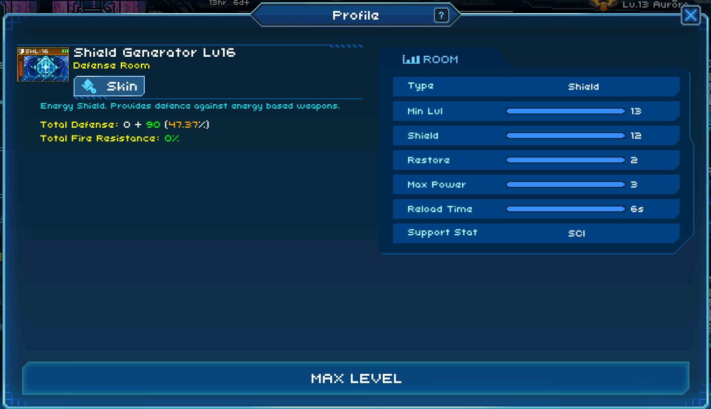

- **PLT** reduce the charge time of every rooms that deploy crafts and increase the attack/repair speed of the crafts. PLT also reduce the charge time of Anti-craft rooms as AA, BT, GDS, etc.
- **SCI** reduce the charge time of Shield , Super Laser, Teleport and Anti-Teleport rooms.
- **ENG** reduce the charge time of Missle rooms and the evasion regenerate of Engine rooms.
- **WPN** increase fire rate of Laser and Cannon rooms.

### **III. Ship Layout**
#### **1. Identify your High-Value Rooms and Protect them**

All rooms with HP can potentially become targets for enemy fire. However, some rooms are consistently targeted or destroyed more frequently, such as SHL, TLP, EMP, AA, etc. The reason is that without these rooms, the ship:
- Loses operational capability
- Loses defensive ability
- Loses offensive power
- Loses the ability to execute tactics

Or because these rooms are:
- Easier to destroy (e.g., rooms with only 2 HP)
- Dangerous to the opponent’s strategy (e.g., a cloaking ship will try to disable Radar; a ship with weak defense will try to disable the Teleport Gate, etc.)

Rooms That Should Be Prioritized for Defense:
- Are critical to your strategy
- Are effective against current meta strategies
- Have low HP

Ways to Prioritize Defense:
- Use more armor (e.g., a 2HP room covered with 5 armor plates, versus a 3HP room with 4 armor)
- Install better protection modules (e.g., if there isn’t enough armor, compensate with higher-grade modules)
- Place the room near protective/repair crews (closer means fewer elevator trips and faster response)

#### **2. Room Placement General Rules**
There are several rules for room placement, which will be covered below:

**Rule #1: Rooms Must Be Connected**

Take a look at the layout below. All combat rooms are connected, allowing crew members to move freely between them. This is a prerequisite for your tank crew to be able to support the entire ship. Whether you're manually controlling them or using AI, rooms must be reachable in order to be accessed.

Conversely, the second image below is an example of disconnected rooms. In theory, this layout has some advantages:
- Since certain rooms aren’t connected, each crew member only has to manage a small number of rooms,
- They can respond quickly, with less running back and forth.
- Additionally, disconnected rooms make it harder for boarding enemies to destroy your ship completely, since they can't access everything easily.

However, that’s all in theory. At higher-level cups, these pros and cons barely matter. Enemy ships focus fire with high intelligence, and if you can’t save your own ship, then nothing else matters.
Boarding crews also don’t come in ones or twos anymore — and their targets vary widely.

Therefore, the recommendation is: keep all your combat rooms connected.

**Rule #2: Cluster High-Value Rooms Together**

No matter what, you’ll often set AI to return your tank crew to a “waiting room.” This waiting room can either be a high-value room itself or a room nearby.

So if your high-value rooms are scattered far apart, your tank crew will have to constantly run long distances. As a result, they’ll run out of stamina quickly, and you'll lose the ability to maintain a stable combat state.

The recommendation: Cluster high-value rooms close to each other.
They don’t need to be directly adjacent (see Rule 3), but you shouldn’t place each high-value room in a separate corner of the ship.
    
**Rule #3: Distribute Waiting Rooms Across the Ship**

A waiting room refers to a fallback spot for tank crew or anti-boarding crew, where they return after completing their task.
For example: if you have a gunner who also plays a defensive role against boarders, then after the defense is done, you may have them return to the nearest laser room. In that case, the laser room acts as their waiting room.

How you define a waiting room and how you set up return logic via AI is up to you. But no matter how you set it, waiting rooms should be placed close to and intermixed with high-value rooms. They should surround high-value rooms like satellites, so that:

When an incident happens (e.g., a high-value room is damaged or boarded), the crew in waiting rooms can react quickly, and after dealing with the situation, they can return quickly without wasting too much time or stamina.

**Rule #4: Avoid Elevators Trapping Your Crew (If Possible)**

Here’s a common mistake: letting elevators trap your crew.

If an elevator ends up blocking access, it can turn into a cage, trapping your crew, or if that area then becomes the focus of enemy fire, the result can be disastrous.

**Rule #5: Elevators Must Be Accessible from Both Ends**

Avoid layouts where elevators are only placed in the center. These can quickly become choke points, which are extremely problematic.

Instead, design your layout so that there are at least two routes to access any room on a different floor. Only then will the number of elevators be sufficient for smooth movement.

**Rule #6: Place Defensive Crew Behind the Room They’re Meant to Protect**

This rule doesn't mean placing the waiting and protected rooms at opposite ends of the ship. Rather, it refers to their relative positions.

If two rooms are near each other, the waiting room (where your tank or anti-boarding crew stays) should be located toward the left rear of the ship, relative to the room it defends.

The reason involves room slot mechanics:
- Slot A for your crew is positioned toward the rear of your ship.
- Slot A for enemy crew is placed toward the left rear of their ship, which is the front of yours.

So, if you design accordingly:
- Your crew will have shorter distances to run
- Your crew will also enter the correct combat slot faster

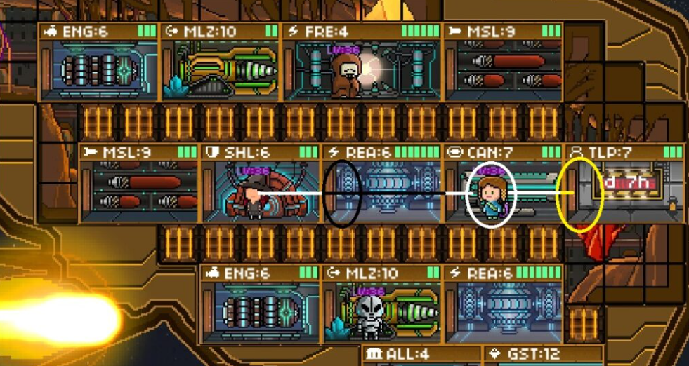
For example (based on the image mentioned):

- Elf can quickly defend the TLP room,
- Witch can quickly defend the REA room.
- However, if Elf had to defend REA instead, she would not only have to run a longer distance, but also expose herself to enemy fire for a much longer time.

**Rule #7: Follow Your Own Playstyle**
This layout guide should not be consider as a goal that you aim for, but a foundation that you can rely on and build your own style. In Summit, we do not want to create an empire of clones but encourage a diversity of strategies. 

Remember, **nothing suits your ship better than your rules.** 

## **B. Crews and Crew's Role**
### **I. Crew Stat**
### **II. Crew Special Ability**
### **III. Crew's Role**
### **IV. Crew's Collections**
**Collection** is a set of crews that will give you bonus effect (call **perk**) if you have some of them place on your ship. Until September 2025, there are 27 collections:

#### **1. Savy Soda**

- Fizzy Perk: gives chances to refresh the crew's ability, allowing it to be activated again, but current ABL stat will be halved
- Trigger condition: Triggers on special ability activation
- Minimum at 50% chance with 4 crews and max at 90% chance with 8 crews on board with a step of 10% each aditional crew

#### **2. Sango**

- Sharpshooter Perk: gives chances to deal 100% of current attack damage to a target enemy crew or an enemy crew in current room
- Trigger condition: Triggers after every 1 attacks against another crew
- Minimum at 2% with 2 crews and max ai 6% with 6 crews with the step of 1% each additional crew

#### **3. Cats**

- Nine Lives Perk: gives 100% chance to revive with number of percentage HP when killed, has a 80 seconds cooldown. The revival also clear all the negative effects on the crew.
- Trigger condition: Triggers when the crew is down
- Minimum at 40% HP with 2 crews and max at 70% HP with 8 crews with the step of 5% HP each additional crew

#### **4. Office Workers**

- Printer Repair Perk: 20% chance to activate Urgent Repair. Repairs current room for number of damage. Has a 20 seconds cooldown
- Trigger condition: Triggers on every 1 repair action
- Minimum at 6 damage repair with 3 crews and max at 9 damage repair with 6 crew with the step of 1 damage repair each additional crew

#### **5. Critters**

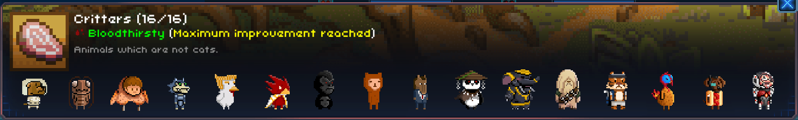
- Bloodthirsty Perk: gives 100% chance to activate Bloodlush. Doubles combat speed for number of seconds
- Trigger condition: Triggers after every 1 attack against another crew. Can only be activated once
- Minimum at 3.5 second with 3 crews and max at 7 second with 10 crews with the step of 0.5 second each additional crew

#### **6. Pirates**

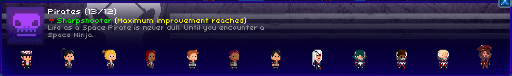
- Same like Sango Collection but max at 5% with 5 crews

#### **7. Federation**
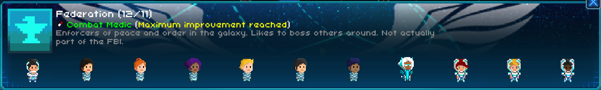

- Combat Medic Perk: gives 100% chance to heal the lowest HP target of other friendly crews in current room for  number of HP.
- Trigger condition: Triggers once every 1 seconds
- Minimum at 0.1 HP with 2 crews and max at 0.4 with 5 crews with the step of 0.1 HP healing each additional crew

#### **8. Qtarian**
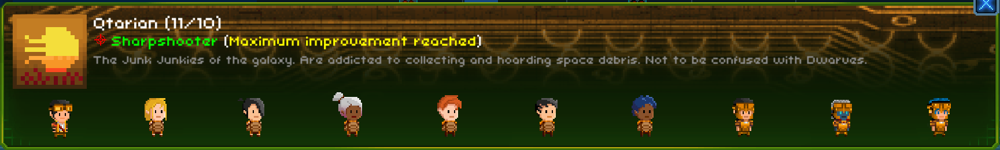
- Same like Sango Collection but minimum at 1% with 2 crews and max at 5% with 5 crews

#### **9. Constellation**
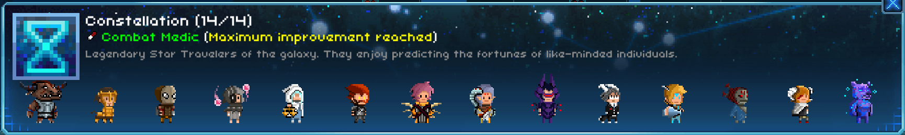
- Same like Federation Collection

#### **10. Alien Tech**
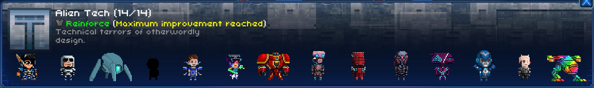
- Reinforce Perk: 100% chance to increase the current room's armor by a number, up to a maximum of 56 bonus armor(including bonuses from other sources)
- Trigger condition: Triggers at the start of battle in the origin room
- Minimum at 32 armor bonus with 3 crews and max at 48 bonus armor with 5 crews with the step of 8 bonus armor each additional crew

#### **11. Gray**
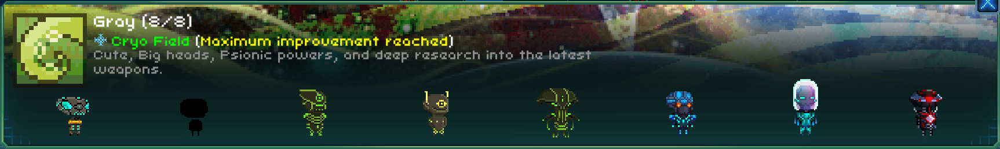
- Cryo Field Perk: 100% chance to inflict a number of seconds freeze on a target enemy crew or an enemy crew in current room
- Trigger condition: Triggers after every 1 attack against another crew
- Minimum at 0.3 second freeze with 3 crews and max at 0.5 second with 5 crews with the step of 0.1 second freeze each additional crew

#### **12. Visiri**
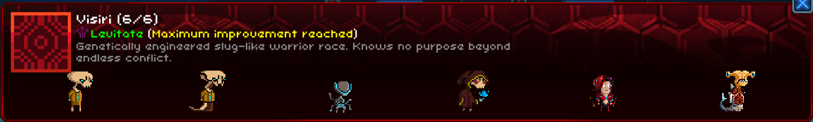
- Levitate Perk: 100% chance to apply a number of percent damage reduction to all friendly crews in current room for 5 seconds
- Trigger condition: Triggers when receiving more than 0 fire damage
- Minimum at 30% damage reduction with 3 crews and max at 50% with 5 crews with the step of 10% each additional crew

#### **13. Ardent**
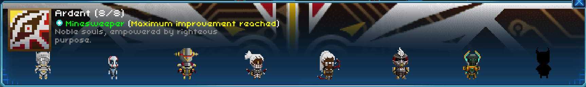
- Minesweeper Perk: 100% chance to destroy up to a number of enemy trap modules in the current room
- Trigger condition: Triggers after entering every 1 rooms. Can only be activate 3 times. Has a 1 seconds cooldown
- Minimum at 1 trap with 3 crews and max at 2 traps with 4 crews

#### **14. Lost Lovers**
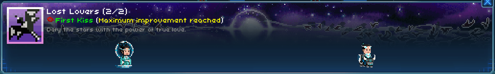
- First Kiss Perk: Same like Cats Collection but the revival gives 100% HP back

#### **15. Seafood**

- Slippery Perk: 100% chance to reduce the next number of instances of damage by 75%. This includes any damage that triggers this ability
- Trigger condition: Triggers at the start of battle in the origin room. Can only be activated once
- Minimum at 3 instances with 3 crews and max at 5 instances with 5 crews with the step of 1 instances each additional crew

#### **16. Task Force Xmas**

- Gifted Perk: 100% chance to activate Gifted. Drops a special gift for your enemies, which will explode agter a 3 seconds delay, dealing a number of damage to all enemy crews in the current room
- Trigger condition: Triggers on taking fatal damage. Can only be activated once
- Minimum at 11 damage with 3 crews and max at 16 damage with 8 crews with the step of 1 damage each additional crew

#### **17. Spooky** 

- Infected Perk: 100% chance to gain a Summoned Zombie with a number of bonus attack (basically increase the crew's attack point)
- Trigger condition: Triggers after every 1 attacks against another crew. Can only be activated once
- Minimum at 1 bonus attack with 3 crews and max at 3.8  bonus attack with 7 crews with the step at 0.7 bonus attack each additional crew

#### **18. Symphony**
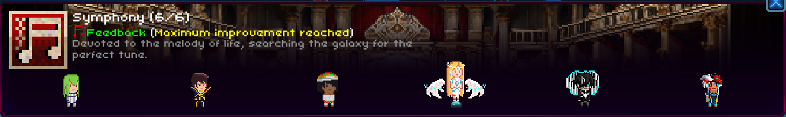
- Feedback Perk: 100% chance to increase the damage of the next number of attacks for the current room by 25%. This will apply to launched Crafts as well. Cannot stack with other damage boosts from perks
- Trigger condition: Triggers at the start of battle in the origin room
- Minimum at 3 attacks with 3 crews and max at 5 attacks with 5 crews with the step of 1 attack each additional crew

#### **19. The Void**

- Warp Perk: gives 100% chance to reduce any freeze status duration on the crew by a number of percent
- Trigger condition: Triggers when stunned for more than 0 seconds
- Minimum at 50% stun reduction time with 4 crews and max at 80% with 7 crews with the step of 10% each additional crew

#### **20. Joseon Traders**
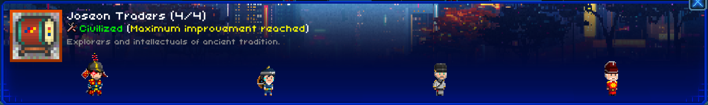
- Civilized Perk: gives 100% chance to increase RPR by 1
- Trigger condition: Triggers at the start of battle in the origin room. Can only be activated once
- Min and max at 1 additional RPR with 4 crews

#### **21. Egg Hunters**
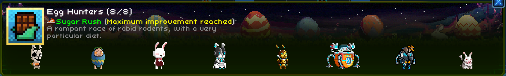
- Sugar Rush Perk: gives 100% chance to gain 1 point to both walk and run speed
- Trigger condition: Triggers at the start of battle in the origin room. Can only be activated once
- Min and max at 1 point with 3 crews

#### **22. Animatronics**

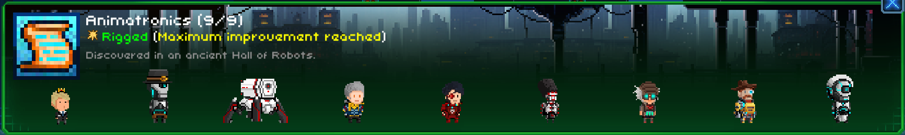
- Rigged Perk: same like Task Force Xmas but min and max at 8 explosive damage to the current room and all of its crews, barrier modules and mine with 3 crews

#### **23. Galactic Mariners**
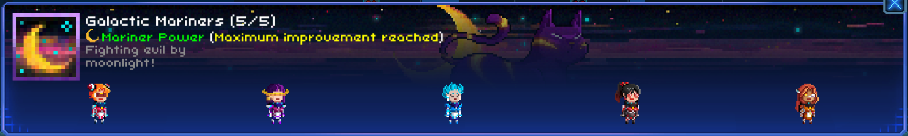
- Marriner Power Perk: gives 100% chance to increase the crew HP to a number of HP
- Trigger condition: Triggers at the start of battle in the origin room. Can only be activated once
- Min at 3 bonus HP with 3 crews and max at 5 bonus HP with 3 crews with the step of 1 bonus HP each additional crew

#### **24. Cosmic Crusaders**
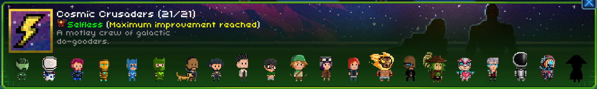
- Selfless Perk: gives 100% chance to activate Healing Rain. Restores a number of HP to all friendly crews in the current room
- Trigger condition: Triggers when receiveing more than 0 damage. Has a 3 seconds cooldown
- Min and max at 2 healing HP with 3 crews

#### **25. Drakian**
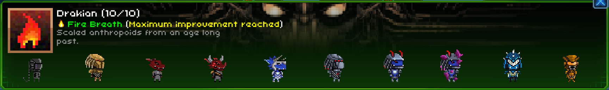
- Fire Breath Perk: gives 100% chance to inflict a number of seconds of fire on the current enemy room
- Trigger condition: Triggers agter every 1 teleports
- Min at 8 seconds with 2 crews, max at 10 seconds with 4 crews 

#### **26. Athletes**
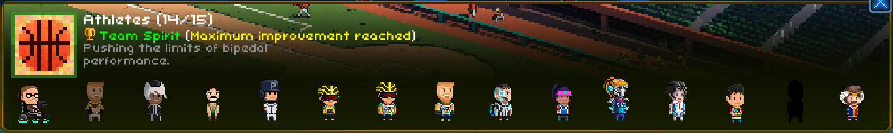
- Team Spirit Perk: gives 100% chance to completely remove all negative status effects duration on the current room
- Trigger condition: Triggers on every 1 attack or repair action. Has a 8 seconds cooldown
- Min and max with 3 crews

#### **27. Cyanide & Happiness**
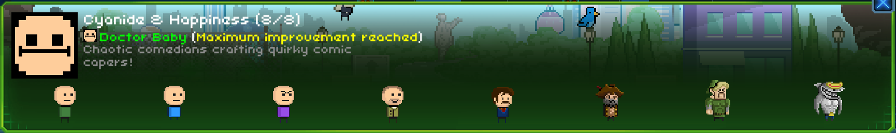
- Doctor Baby Perk: gives 100% chance to activate First Aid. Restores a number of HP to self
- Trigger condition: Triggers on taking fatal damage. Can only be activated once
- Min at 6 restoring HP with 4 crews and max at 10 HP with 8 crews with the step of 1 restoring HP each additional crew

### **V. Crew's Combat Positioning**

## **C. Strategies**